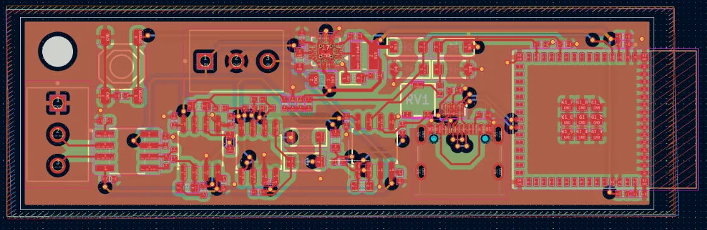
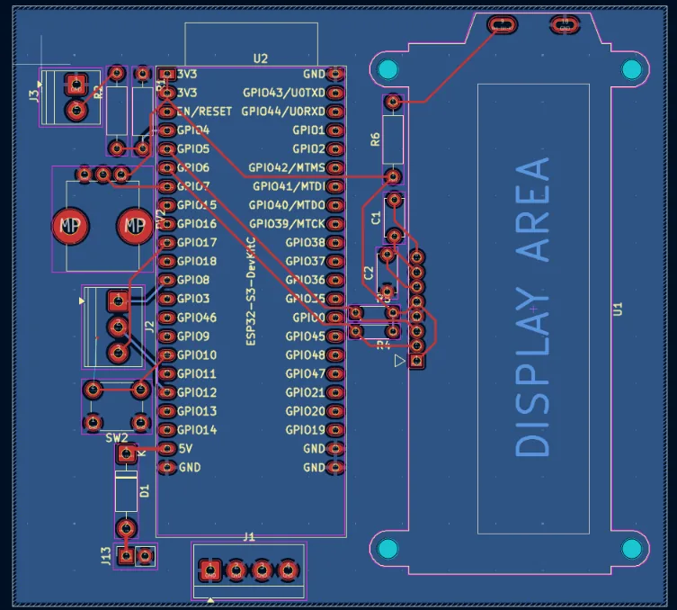
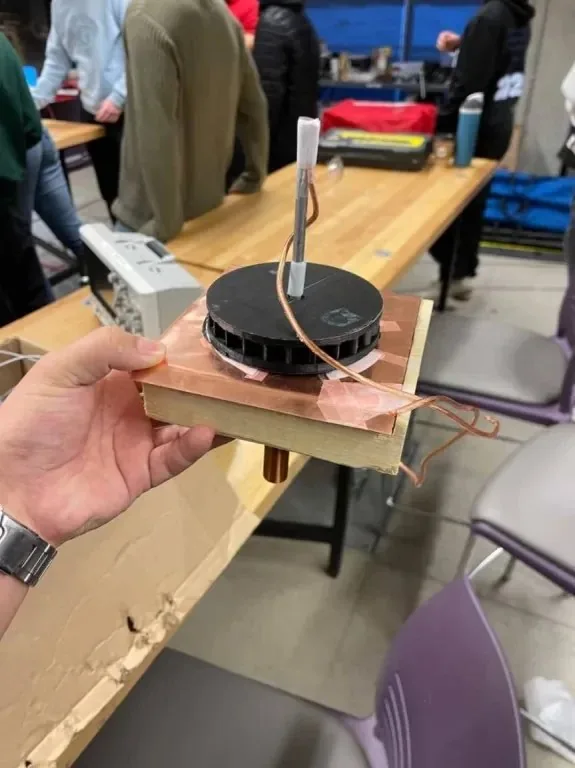
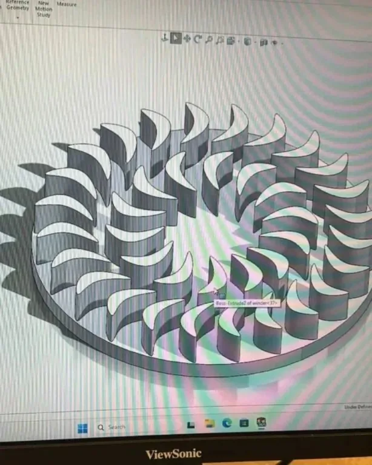
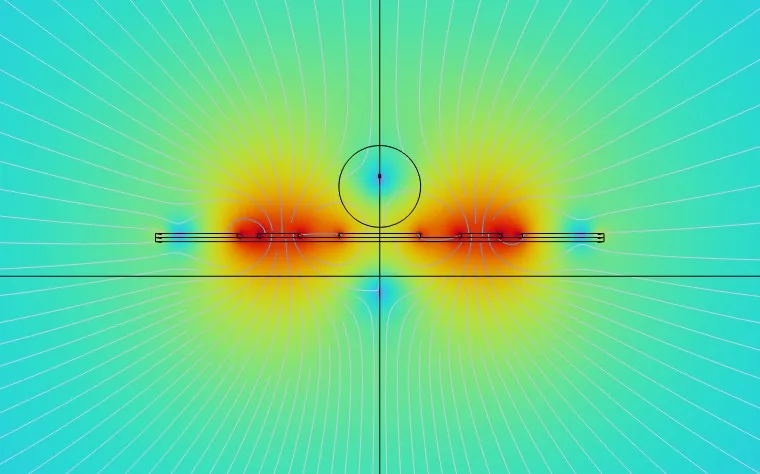

# Arjun Mahes
Mechatronics engineering @UWaterloo.

## Socials
- [GitHub](https://github.com/Arjun-Mahes)
- [LinkedIn](https://www.linkedin.com/in/arjun-mahes/)
- [Email](mailto:a2mahes@uwaterloo.ca)

## Home
- 🤖 robots & semiconductors
- ⚡ embedded systems and testing at Soneil Spark
- 🔬 fab hardware at Hacker Fab
- 🦾 exoskeletons for stroke rehab

<!--
  PROJECTS
  Each project is a "### Title" block. The lines below it are:
       card + popup photo (placeholder shown until the file exists)
    Where:   shown above the title on the card
    Status:  shipped | in progress | prototype | 1st place
    Tags:    hardware, software   (drives the filter buttons)
    Tools:   shown on the card footer
    Summary: 1-2 lines on the card
  Anything after that (bullets, paragraphs) only shows in the popup when the card is clicked.
-->
## Projects
### Stroke Rehab Exoskeleton

Where: Personal
Status: in progress
Tags: hardware, firmware, software
Tools: SolidWorks, Altium, STM32CubeMX
Summary: An elbow exoskeleton that only helps as much as the patient needs, reading their muscles (and eventually their brain) to decide when to assist.
- After a stroke, people recover faster when they try to move on their own, so I wanted a device that steps back as they get stronger instead of doing all the work.
- I designed the elbow joint in SolidWorks and the electronics in Altium: an STM32 that talks to the motor driver, a magnetic encoder, an ESP32 and two EMG sensors.
- The motor is a 3-phase BLDC running field-oriented control. The firmware gives less torque the harder the patient's own muscles are working, so the help fades as they recover.
- Right now I'm training a deep learning model on EEG to detect when someone is just thinking about moving, so the arm can kick in from intent alone. The ESP32 handles the wireless link for that.

### Scanning Tunneling Microscope

Where: Personal
Status: in progress
Tags: hardware, firmware
Tools: SolidWorks, KiCad, C++
Summary: Building a microscope at home that can see individual atoms, from the vibration isolation to the electronics.
- At atomic scales everything is noise, even someone walking in the next room, so I built a damped isolation stage out of magnets, springs and threaded rods.
- The scan head uses piezoelectric material to move the tip less than an angstrom at a time across the sample.
- I've designed and checked the schematics for the preamp and the control board (DACs, ADCs, op-amps and a lot of noise reduction), and I'm now laying out the PCBs.
- Next up is the C++ PI feedback loop that keeps the tip at the right height while it scans.

### EV Charger Test Systems

Where: Soneil Spark · 2026
Status: shipped
Tags: hardware, firmware, software
Tools: C++, ESP32, Raspberry Pi
Summary: Test rigs I built at Soneil that put every EV charger through its safety checks on their own, in about two minutes.
- Every charger has to pass government safety tests before it ships, and doing them by hand was slow, so I automated it.
- The rigs use relay boards and contactors to switch the charger through each test, and fake the signals a real car sends so the charger thinks one is plugged in.
- I wrote the firmware in C++ on an ESP32 and built dashboards on a Raspberry Pi, so an operator just hits start and the results get logged. Each charger now takes about two minutes.

### Third Thumb Prosthetic

Where: Personal
Status: prototype
Tags: hardware, firmware
Tools: SolidWorks, Altium, nRF52810
Summary: A robotic extra thumb you wear on your hand, controlled with your forearm muscles or by pressing your toes.
- I designed the thumb in SolidWorks with two servos, so it can bend and grip.
- I wanted two ways to control it, so I made two wireless boards: an EMG amplifier on an ESP32 that reads your forearm muscles, and a shoe with two pressure sensors on an nRF52810 that turns toe pressure into thumb movement.

### EMG Amplifier PCB

Where: Personal
Status: complete
Tags: hardware, firmware
Tools: KiCad, ESP32-S3, Analog design
Size: wide
Summary: My own board for reading muscle signals and sending them wirelessly, built as the input for my prosthetic and exoskeleton.
- I rebuilt the Advancer Technologies EMG circuit in KiCad: an instrumentation amp, a couple of gain stages, filters, and a rectifier that turns the raw signal into a smooth "how hard is this muscle working" envelope.
- Then I added an ESP32-S3 that samples that envelope and sends it wirelessly to whatever needs it, with USB-C for programming.
- The analog side runs off two 9 V batteries.

### Hacker Fab

Where: Waterloo Hacker Fab · 2025
Status: prototype
Tags: hardware, firmware
Tools: KiCad, ESP32, Stepper motor
Size: normal
Summary: Hardware I've built for Waterloo Hacker Fab, a student fab where we make our own semiconductor tools from scratch.
**Argon mass flow controller**

- I designed this board in KiCad to control how much argon flows into our PVD sputtering system.
- The ESP32 reads a pressure sensor and a knob that sets the flow you want, then tells a stepper motor how far to turn the gas valve.
- There's a small LCD so you can see what it's doing, and a diode on the power input so plugging it in backwards doesn't fry anything.

### Triboelectric Nanogenerators

Where: Personal
Status: complete
Tags: hardware
Tools: SolidWorks, Aluminum, Copper, PTFE
Size: tall
Summary: A little generator that turns moving air into electricity using static, the same effect that shocks you after walking on carpet.
- When two different materials touch and pull apart, one steals electrons from the other and they end up oppositely charged. That's the triboelectric effect, and we used it to make power.
- Our generator has a spinning rotor that air pushes around. As it turns, layers of aluminum, copper, nylon and Teflon keep touching and separating, building up charge each time.
- Because the charge flips back and forth with every turn, it pushes current back and forth through an external circuit as AC.
- We designed the whole thing in SolidWorks (the rotor, the contact surfaces and the housing the air blows through) and built it mostly out of cheap household materials.
- It held 30–50 V for over two minutes and got up to 52 V, from something you can hold in one hand.

### Neural Style Transfer

Where: Personal
Status: complete
Tags: software
Tools: PyTorch, VGG19, Python
Summary: Repainting any photo in the style of a painting, by letting a neural network judge how close the picture is getting.
Link: [View the code](https://github.com/Arjun-Mahes/Neural-Style-Transfer)
- I implemented the Gatys et al. method in PyTorch. A pretrained VGG19 looks at both images: one of its deeper layers captures what's in the photo, and patterns across five layers capture the painting's style.
- Instead of training a network, it edits the image's pixels directly, nudging them until the result keeps the photo's content but picks up the painting's brushstrokes.
- Here it's a golden retriever puppy repainted as a Japanese wave woodblock print.
- I also wrapped it in a Streamlit app, so you can upload your own two images, watch it work and download the result. The code is on GitHub.

### Ion Trap Simulation

Where: HardHaQ Hackathon
Status: 1st place
Tags: software
Tools: COMSOL, Python, SciPy
Summary: At HardHaQ, my team designed better traps for holding the atoms in a quantum computer, and won 1st place.
Link: [View the study](https://www.tqetchs.xyz/)
- Trapped-ion quantum computers hold charged atoms in place with electric fields, and the shape of the trap decides how well it holds them. We simulated two kinds in COMSOL: a classic rod (Paul) trap and a flat surface trap.
- I built a Python pipeline that drove COMSOL through parameter sweeps, using optimizers to tune the geometry and voltages for a deeper, more symmetric trap that uses less RF power.
- Our surface trap ended up with twice the trap depth of the rod design, using about 32,700x less RF power.
