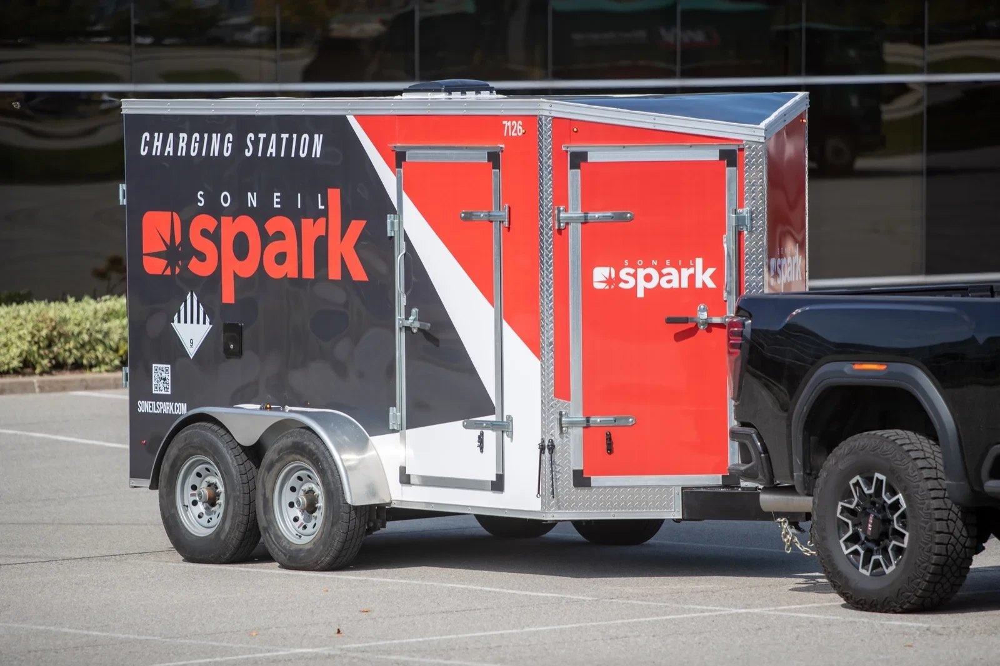
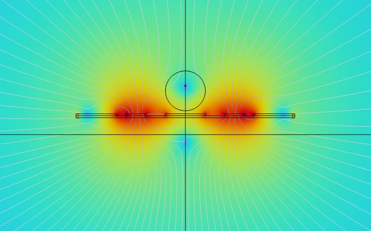

# Arjun Mahes
Mechatronics engineering @UWaterloo.

## Socials
- [GitHub](https://github.com/Arjun-Mahes)
- [LinkedIn](https://www.linkedin.com/in/arjun-mahes/)
- [Email](mailto:a2mahes@uwaterloo.ca)

## Home
- 🤖 robots & semiconductors
- ⚡ embedded systems and testing at Soneil Spark
- 🔬 fab hardware at Hacker Fab
- 🦾 exoskeletons for stroke rehab

<!--
  PROJECTS
  Each project is a "### Title" block. The lines below it are:
       card + popup photo (placeholder shown until the file exists)
    Where:   shown above the title on the card
    Status:  shipped | in progress | prototype | 1st place
    Tags:    hardware, software   (drives the filter buttons)
    Tools:   shown on the card footer
    Summary: 1-2 lines on the card
  Anything after that (bullets, paragraphs) only shows in the popup when the card is clicked.
-->
## Projects
### Stroke Rehab Exoskeleton

Where: Personal
Status: in progress
Tags: hardware, firmware, software
Tools: SolidWorks, Altium, STM32CubeMX
Summary: An elbow exoskeleton that assists only as much as the patient needs, driven by EMG and eventually EEG.
- Designed the elbow joint assembly and the electrical system in Altium: an STM32 talking over SPI, I2C and UART to a motor driver, magnetic encoder, ESP32 and two EMG sensors.
- Implemented Field-Oriented Control for a 3-phase BLDC motor, with assist-as-needed firmware that scales torque inversely to EMG muscle activation, so support drops as the patient recovers.
- Developing an EEG deep learning model for motor imagery detection to trigger the assist, with the ESP32 handling wireless telemetry for the brain-computer interface.

### Scanning Tunneling Microscope

Where: Personal
Status: in progress
Tags: hardware, firmware
Tools: SolidWorks, KiCad, C++
Summary: A homebuilt STM with a piezo scan head, magnetic vibration isolation, and custom preamp and control electronics.
- Designed a damped vibration isolation system using magnets, springs and threaded rods.
- Engineered a piezoelectric scan head capable of sub-angstrom movement across a substrate.
- Designed schematics for the preamplifier and control circuits (DACs, ADCs, op-amps, noise reduction); now moving from validated schematics to routing.
- Writing a continuous PI feedback loop in C++ to regulate sensor inputs and actuator states in real time.

### EV Charger Test Stations

Where: Soneil Spark · 2026
Status: shipped
Tags: hardware, firmware, software
Tools: C++, ESP32, Raspberry Pi
Summary: Automated high-voltage AC/DC test rigs that run a charger through its safety compliance checks in about two minutes.
- Integrated relay boards, contactors and simulated EV-to-EVSE communication to validate government safety compliance.
- Wrote custom C++ firmware and built dashboards on a Raspberry Pi and ESP32 to run the test hardware autonomously, cutting the test cycle to 2 minutes per charger.

### Third Thumb Prosthetic

Where: Personal
Status: prototype
Tags: hardware, firmware
Tools: SolidWorks, Altium, nRF52810
Summary: A wearable robotic extra thumb, controlled by forearm EMG or by pressing your toes in a sensor-equipped shoe.
- Designed the CAD in SolidWorks, with two servo motors for digit articulation and grip control.
- Designed two wireless transmitter PCBs for dual-mode proportional control: an ESP32-based EMG amplifier with signal filtering, and an nRF52810 dual-FSR shoe that turns toe pressure into multi-axis joint movement.

### EMG Amplifier PCB

Where: Personal
Status: complete
Tags: hardware, firmware
Tools: KiCad, ESP32-S3, Analog design
Summary: A custom board that amplifies and filters muscle signals, then digitizes them on an ESP32-S3 and streams them wirelessly.
- Rebuilt the Advancer Technologies EMG analog chain in KiCad: instrumentation amplifier, gain stages, a ~106 Hz high-pass, full-wave rectifier and a ~2 Hz envelope low-pass with a trimmable final gain.
- Added an ESP32-S3 to sample the envelope and broadcast it wirelessly to another microcontroller, with native USB-C for programming and a buck converter for the 3.3 V rail.
- Runs from split ±9 V batteries for the analog side; built as the muscle-sensing front end for my prosthetic and exoskeleton projects.

### Argon Mass Flow Controller

Where: Hacker Fab · 2025
Status: prototype
Tags: hardware, firmware
Tools: KiCad, ESP32, Stepper motor
Summary: A custom ESP32 board and closed-loop controller that meters argon into a PVD sputtering system.
- Designed a custom PCB in KiCad with an ESP32 and a motor driver.
- Engineered a closed-loop controller that reads a pressure sensor and commands a stepper motor to actuate the gas tank valve, regulating argon flow.

### Triboelectric Nanogenerators

Where: Personal
Status: complete
Tags: hardware
Tools: Materials, Energy harvesting
Summary: Harvesting electricity from contact and motion using triboelectric materials.
- Details coming soon.

### Neural Style Transfer

Where: Personal
Status: complete
Tags: software
Tools: PyTorch, VGG19, Python
Summary: Repainting a photo in the style of another image by optimizing the pixels against a pretrained VGG19 network.
Link: [Try the app](http://localhost:8501)
- Implemented Gatys et al.'s method in PyTorch: content comes from VGG19's conv4_2 features, style from Gram matrices across five convolutional layers.
- Weighted the style layers from fine brushstrokes (conv1_1) down to large structures (conv5_1), with the style loss weighted 10⁶ to 1 against content.
- Optimized the image itself (not a network) with Adam for 10,000 steps on a GPU; here a golden retriever photo repainted in the style of a Japanese wave woodblock print.
- Built a Streamlit app around it: upload a photo and a style image, watch a live preview as it optimizes, and download the result.

### Ion Trap Simulation

Where: HardHaQ Hackathon
Status: 1st place
Tags: software
Tools: COMSOL, Python, SciPy
Summary: Optimized trapped-ion quantum computer geometries in COMSOL. Our surface trap doubled trap depth and took 1st place.
- With a team of 4, simulated and optimized Paul and surface trap geometries in COMSOL Multiphysics.
- Built a Python–COMSOL pipeline using parameter sweeps and SciPy optimizers (Nelder-Mead, SLSQP) to tune geometry and voltages against trap depth, symmetry and RF power.
- Designed a novel surface-electrode trap with 2x the trap depth and over 30,000x lower estimated RF power than the baseline rod design.
